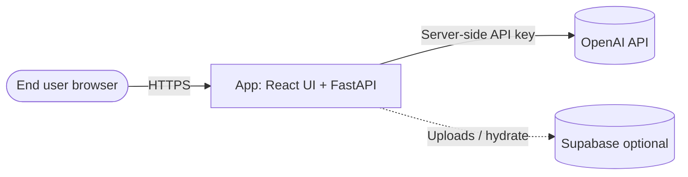
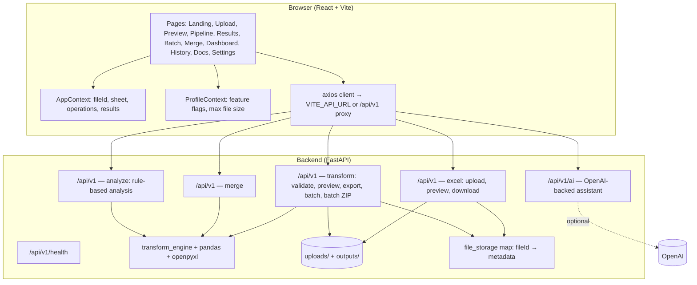
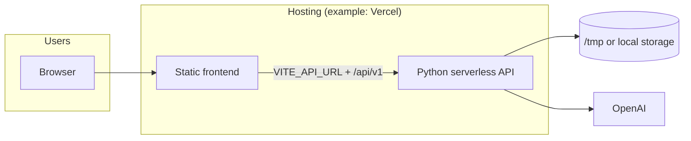

# Functional workflow and system architecture

This document describes how the **Excel Data Transformation Tool** behaves end-to-end: user flows on the frontend, how they map to API calls, and how the backend processes data. It reflects the current codebase (React + FastAPI).

---

## 1. System context



At a high level: the **browser** talks only to the **deployed app** (static frontend + API). **OpenAI** is used only when `OPENAI_API_KEY` is set on the backend. **Supabase** is optional for upload storage/hydration when configured.

---

## 2. Logical architecture



**Frontend** (`frontend/`): React Router drives navigation; **AppContext** holds the current `fileId`, selected sheet, pipeline `operations`, and transform/batch/merge results so Preview → Pipeline → Results stays coherent. **ProfileContext** gates UI (KPIs, batch, merge, AI panels) and client-side upload size. **API** calls use `VITE_API_URL` in production or the dev proxy to `/api/v1`.

**Backend** (`backend/app/`): Routers under `app/api/v1/` expose REST endpoints. **Transform** logic runs through `transform_engine` and **pandas**; Excel IO uses **openpyxl** and helpers. **Uploads** and **exports** are written under configurable storage (`./uploads`, `./outputs` locally, or `/tmp/...` on Vercel). An in-memory **`file_storage`** dict maps `fileId` to paths and metadata (rebuilt from disk on startup when possible).

---

## 3. Single-file functional workflow

Sequence: **Upload → Preview → Build pipeline → Preview transform → Export (optional)**.

```mermaid
sequenceDiagram
    participant U as User
    participant FE as React app
    participant API as FastAPI
    participant FS as Disk / storage

    U->>FE: Select file / upload
    FE->>API: POST /api/v1/upload-excel (multipart)
    API->>FS: Save file, assign fileId
    API-->>FE: fileId, sheet names, metadata
    FE->>FE: Navigate /preview; AppContext.uploadData

    U->>FE: Choose sheet, optional analysis
    FE->>API: GET /api/v1/preview-sheet?fileId&sheetName
    API->>FS: Load file
    API-->>FE: Rows sample, columns, data quality

    U->>FE: Add / reorder operations
    FE->>API: POST /api/v1/validate-pipeline (optional)
    FE->>API: POST /api/v1/preview-transform
    API-->>FE: Transformed preview rows

    U->>FE: Download final Excel
    FE->>API: POST /api/v1/export-transform
    API->>FS: Write styled Excel to outputs/
    API-->>FE: File or blob for download
```

**State:** `AppContext` keeps `uploadData`, `selectedSheet`, `operations`, and `transformResult` so each step does not need to re-upload the file.

**Typical API mapping**

| User action | API (prefix `/api/v1`) |
|-------------|-------------------------|
| Upload | `POST /upload-excel` |
| Preview sheet | `GET /preview-sheet` |
| Validate pipeline | `POST /validate-pipeline` |
| Preview after transform | `POST /preview-transform` |
| Export workbook | `POST /export-transform` |
| (Optional) stats-style analysis | `POST /analyze-data` (analyze router) |

---

## 4. Batch processing workflow


**Frontend:** `BatchPage` requires `multipleFiles` in context; if empty, redirect to `/upload/batch`. **Backend:** `batch-transform` applies the same operation list to each file; **ZIP** download uses `download-batch-zip` with a `zipId` when the response includes it.

---

## 5. Merge workflow


**Strategies** (from UI): **append** (stack rows), **join** (column + join type: inner/left/right/outer), **union** (combine columns). The backend merges files referenced by `fileIds`.

---

## 6. AI and analysis (two paths)

| Path | Purpose | Backend |
|------|---------|---------|
| **Rule-based** | Insights from columns/rows in the client (no LLM) | `POST /api/v1/analyze-data` |
| **LLM assistant** | Chat, suggestions, explanations (when configured) | `POST /api/v1/ai/analyze-data`, `/chat`, `/explain-insight`, `/suggest-next-step` |

The LLM path **requires** `OPENAI_API_KEY` on the server; failures surface as configurable HTTP errors (e.g. 503) with user-friendly messages.

---

## 7. Cross-cutting concerns

| Concern | Implementation |
|---------|------------------|
| **CORS** | `ALLOWED_ORIGINS` env (comma-separated); frontend origin must match. |
| **Max upload size** | Middleware `Content-Length` check vs `MAX_FILE_SIZE`; profile also limits client-side. |
| **Rate limiting** | `slowapi` limiter on selected routes. |
| **Temp files** | Periodic cleanup of `uploads/` and `outputs/`; shorter retention on serverless. |
| **Optional Supabase** | When env vars are set, uploads can be mirrored or hydrated for multi-instance or serverless consistency. |

---

## 8. Deployment view (typical)



The **frontend** is a static build; the **backend** runs as a serverless or long-running process depending on deployment. **Ephemeral filesystem** implies uploads may not survive cold starts unless **Supabase** (or similar) is used for persistence.

---

## 9. Document index

| Area | Main locations |
|------|----------------|
| Routes | `frontend/src/App.tsx` |
| Shared flow state | `frontend/src/context/AppContext.tsx` |
| API client | `frontend/src/lib/api.ts` |
| App entry | `backend/app/main.py` |
| Excel upload / preview | `backend/app/api/v1/excel.py` |
| Transform / batch | `backend/app/api/v1/transform.py` |
| Merge | `backend/app/api/v1/merge.py` |
| Rule-based analyze | `backend/app/api/v1/analyze.py` |
| AI | `backend/app/api/v1/ai.py`, `backend/app/services/ai_assistant.py` |
| Core engine | `backend/app/transform_engine.py` |

---

*This is a functional description for architecture and onboarding; it is not a formal security assessment.*
